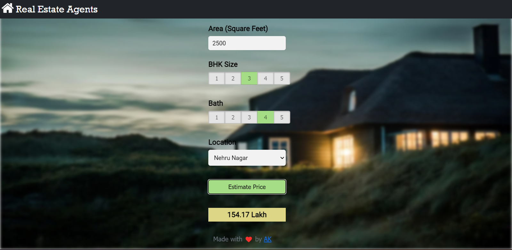

# Real Estate Price Predictor

Predicting house prices can help to determine the selling price of a house of a particular region and can help people to find the right time to buy a home. In this project, I've have made a machine learning project to predict the house price depending oin various parameters such as location,Bhk Size, No of Bathrooms and the location.

Note: This project is made using Jupyter Notebook and the [Bangalore Dataset](https://www.kaggle.com/amitabhajoy/bengaluru-house-price-data) is taken from Kaggle.

## Screenshot:

</img>

## Demo:

<video src="./assets/demo.mp4"></video>
